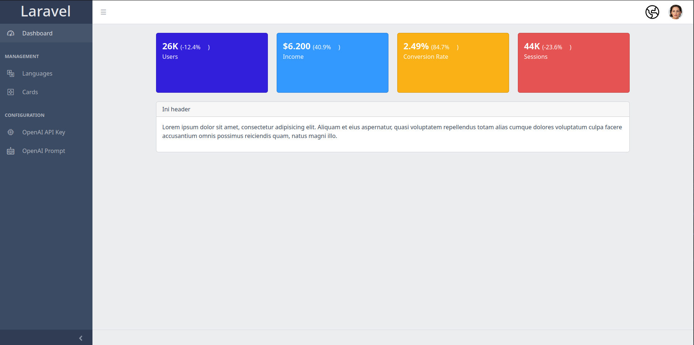

## Admin Panel



### Deployment to docker

Export UID and GID linux from host

```sh
export UID=$(id -u) && export GID=$(id -g)
```

Run docker compose in terminal

```sh
docker compose -f .docker/docker-compose.yml up -d
```

if you make change in your code, restart docker and rebuild using this command

```sh
docker compose -f .docker/docker-compose.yml up --build -d
```

### Run Artisan command

To run artisan command you need to execute `fpm` service in docker using like this

```sh
docker compose -f .docker/docker-compose.yml exec fpm php artisan
```

if you want migrate database you can execute this command

```sh
docker compose -f .docker/docker-compose.yml exec fpm php artisan migrate:fresh --seed
```

### Remove docker

Dispose docker image and volume

```sh
docker compose -f .docker/docker-compose.yml down -v
```

### Postman API Info

[Download Postman JSON](https://api.postman.com/collections/11794634-4120312c-c4dc-4053-a1ea-e932f9ecf649?access_key=PMAT-01GXST70S9D72TTBF0FMT3VNA7)
